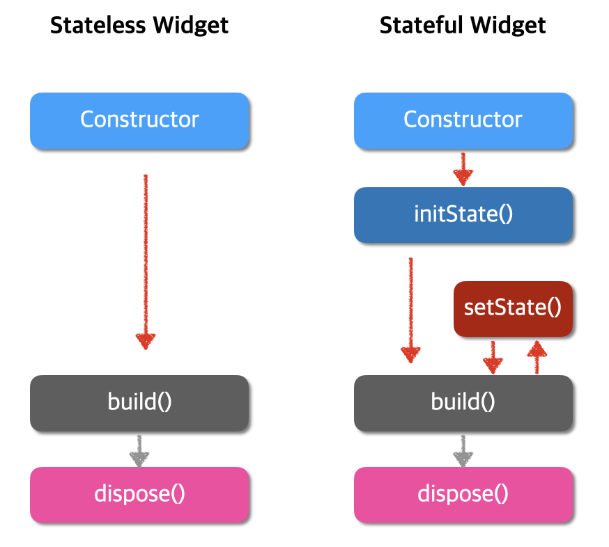

## showDialog 오류

**No MaterialLocalizations found.** 오류가 나면서 실행이 되지 않음.

```dart
runApp(const MyApp());

runApp(MaterialApp(home: MyApp()));
```

## state / stateful / stateless

### state
위젯이 빌드될 때 동기적으로 읽을 수 있는 정보  
위젯의 생명주기가 끝나기 전까지 변경될 수 있는 정보

| stateless     | stateful        |
|---------------|-----------------|
| 상태를 변경할 수 없음  | 상태가 변경되면 다시 그려짐 |




## shared_preferences 애러

MissingPluginException(No implementation found for method getAll on channel plugins.flutter.io/shared_preferences)

핫리로드 상태에서 발생.  
완전히 종료 후 재빌드 하면 발생하지 않음.

## No Material widget found 에러 

To introduce a Material widget, you can either directly include one, or use a widget that contains
Material itself, such as a Card, Dialog, Drawer, or Scaffold.

